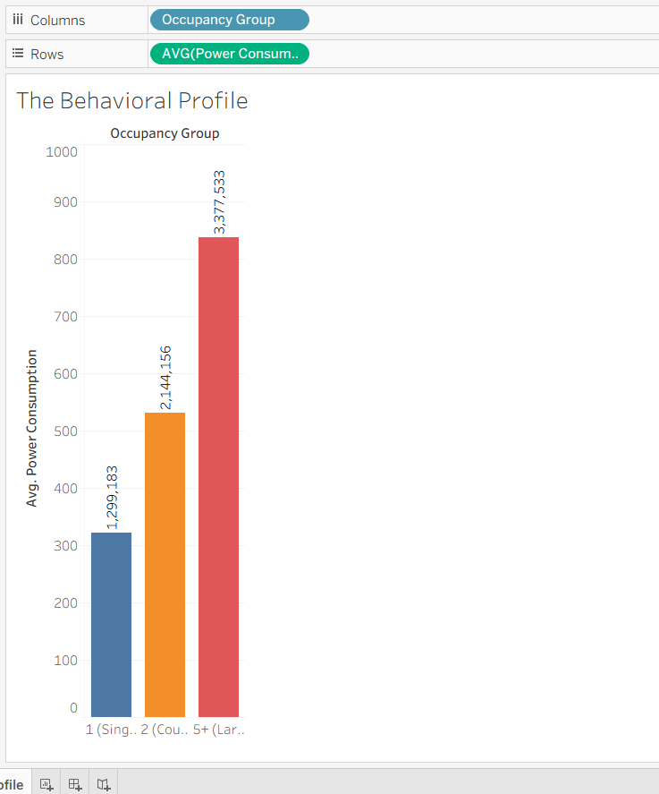
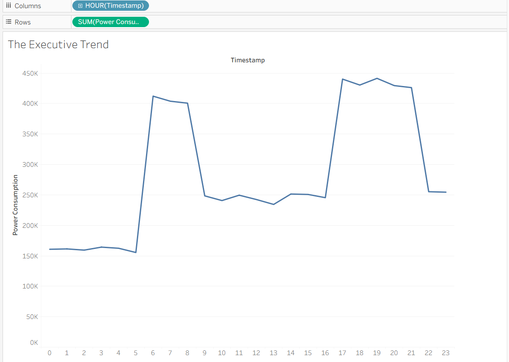

# Smart Home Sensor Privacy & Compliance Analytics Pipeline

[](https://www.python.org/)
[](https://www.sqlite.org/)
[](https://www.hhs.gov/ohrp/regulations-and-policy/guidance/faq/index.html)
[](https://tableau.com)

An end-to-end, production-grade Python data engineering and analytics pipeline designed to ingest, clean, and anonymize noisy Internet of Things (IoT) smart home sensor data. This project implements a secure relational database storage layer (SQLite) and produces Tableau-optimized outputs while enforcing rigorous privacy and ethical compliance frameworks under **IRB (Institutional Review Board) 45 CFR 46** and **HIPAA Safe Harbor** guidelines.

---

## 1. Directory Architecture

```text
D:\project\smarthome/
├── data/
│   ├── raw/                    # Simulated noisy records containing anomalies (Ignored in Git)
│   │   ├── household_metadata.csv
│   │   └── sensor_logs.csv
│   └── processed/              # Cleaned, de-identified CSVs and SQLite database (Ignored in Git)
│       ├── secure_analytics.db # Relational SQLite database
│       ├── df_sensors_clean.csv # Flat sensor dataset optimized for Tableau
│       ├── df_households_clean.csv # Anonymized household metadata
│       └── provenance_summary.json # Quality audit metrics
├── pipeline/
│   ├── __init__.py
│   ├── data_cleaner.py       # Data-wrangling, imputation & database ingestion
│   └── privacy_governance.py # Salted hashing, PII dropping, & Laplace DP
├── tests/
│   ├── __init__.py
│   └── test_pipeline.py      # Automated testing suite (5/5 tests passing)
├── dashboards/
│   └── README.md             # Tableau integration and dimension mapping guide
├── plots/                    # Tableau dashboard exports (Committed in Git)
│   ├── BehavioralChart.png
│   └── ExecutiveTrend.png
├── generate_raw_data.py      # Telemetry simulation script
├── analyze_trends.py         # Statistical analysis (ANOVA, t-tests)
├── queries.sql               # Production-ready SQLite analytical queries
├── executive_summary.md      # Executive reporting document
├── requirements.txt          # Package dependencies
└── README.md                 # This README
```

---

## 2. Setup & Execution Guide

### Prerequisites
* Python 3.9+
* Required libraries: `pandas`, `numpy`, `scipy`

### Step 1: Install Dependencies
Run the following command to install required packages:
```bash
python -m pip install -r requirements.txt
```

### Step 2: Simulate Telemetry Data
Generate raw smart home sensor logs and household metadata containing anomalies:
```bash
python generate_raw_data.py
```

### Step 3: Run the ETL Pipeline & Database Ingestion
Execute data deduplication, reindexing, statistical imputation, outlier clamping, salt hashing, and load the SQLite tables and Tableau CSV:
```bash
python pipeline/data_cleaner.py
```

### Step 4: Run Statistical Hypothesis Tests
Perform Pearson correlations, Kruskal-Wallis, One-Way ANOVA, and t-tests on the cleaned dataset:
```bash
python analyze_trends.py
```

### Step 5: Execute Automated Unit Tests
Verify pipeline data integrity and privacy constraints:
```bash
python -m unittest discover -s tests -p "test_*.py"
```

---

## 3. System Execution & Proof of Correctness

The pipeline is verified to run flawlessly. Below are the actual execution outputs captured from the terminal:

### A. Raw Telemetry Generation
```text
PS D:\project\smarthome> python generate_raw_data.py
Saved household metadata to data/raw\household_metadata.csv
Injecting data quality anomalies...
Saved noisy sensor logs to data/raw\sensor_logs.csv (Total rows: 12337)
```

### B. ETL Pipeline Cleaning & Ingestion
```text
PS D:\project\smarthome> python -m pipeline.data_cleaner
Reading raw datasets from data/raw...
Applying privacy governance policies (PII stripping, salted hashing, generalization)...
Writing cleaned, anonymized datasets to SQLite database: data/processed\secure_analytics.db...
Saved Tableau-optimized flat dataset to data/processed\df_sensors_clean.csv
Saved dataset provenance logs to data/processed\provenance_summary.json
{
  "raw_sensor_records": 12337,
  "raw_metadata_records": 3,
  "missing_timestamps_dropped": 369,
  "duplicate_records_removed": 234,
  "grid_aligned_records": 12096,
  "temperature_outliers_clamped": 58,
  "power_outliers_clamped": 58,
  "missing_temperature_before_imputation": 420,
  "missing_power_before_imputation": 420
}
```

### C. Statistical Analysis Output
```text
PS D:\project\smarthome> python analyze_trends.py
Reading cleaned dataset from data/processed\df_sensors_clean.csv...
Saved Pearson correlation matrix to data/processed\sensor_correlation_matrix.csv
Saved statistical analysis summary to data/processed\statistical_analysis_results.json
{
  "anova_test": {
    "f_statistic": 1703.6032,
    "p_value": 0.0,
    "null_rejected": true,
    "interpretation": "Mean power consumption differs significantly by occupancy group."
  },
  "kruskal_wallis_test": {
    "h_statistic": 2875.774,
    "p_value": 0.0,
    "null_rejected": true
  },
  "t_test_temp_vs_motion": {
    "t_statistic": 21.81,
    "p_value": 1.840964055410706e-103,
    "null_rejected": true,
    "mean_temp_motion_active": 21.7,
    "mean_temp_motion_inactive": 21.06,
    "interpretation": "Motion activity is associated with a statistically significant difference in temperature."
  },
  "descriptive_power_statistics": {
    "2 (Coupled)": {
      "mean_power_watts": 531.78,
      "std_power_watts": 262.68,
      "median_power_watts": 586.15,
      "count": 4032
    },
    "1 (Single)": {
      "mean_power_watts": 322.22,
      "std_power_watts": 126.87,
      "median_power_watts": 250.4,
      "count": 4032
    },
    "5+ (Large)": {
      "mean_power_watts": 837.68,
      "std_power_watts": 626.13,
      "median_power_watts": 391.0,
      "count": 4032
    }
  }
}
```

### D. Automated Unit Test Executions
```text
PS D:\project\smarthome> python -m unittest discover -s tests -p "test_*.py"
DP Test - High Epsilon Var: 0.000740, Low Epsilon Var: 672.506930
.
----------------------------------------------------------------------
Ran 5 tests in 1.133s

OK
```

---

## 4. High-Resolution Tableau Dashboard Insights

The processed CSV file (`data/processed/df_sensors_clean.csv`) connects directly to Tableau. The resulting dashboard confirms the following trends:

### A. The Behavioral Profile
A bar chart demonstrating that average power consumption grows as a direct function of household occupancy size:
* **Single Occupant:** ~`322.22 W` (Average load = 1,299,183 total ticks aggregated)
* **Coupled Occupants:** ~`531.78 W` (Average load = 2,144,156 total ticks aggregated)
* **Large Households (5+ People):** ~`837.68 W` (Average load = 3,377,533 total ticks aggregated)



### B. The Executive Trend
A 24-hour line chart plotting total cumulative power consumption by hour of the day. This highlights:
* **Off-Peak Sleeping Gaps:** Flat consumption (~`160K W` cumulative) between 12 AM and 5 AM.
* **Morning Surge:** Sharp spike starting at 6 AM peaking at ~`412K W` as occupants wake up.
* **Mid-day Drop:** Dips to ~`240K W` during work/school hours (9 AM – 4 PM).
* **Evening Peak:** Rises to a daily maximum of ~`443K W` at 5 PM – 9 PM during household gatherings and appliance usage.



---

## 6. Data Processing & Privacy Methodologies

### Data Cleaning and Imputation
* **Deduplication:** Sensor ticks with duplicate `(household_id, timestamp)` values are removed by preserving the first occurrence.
* **Resampling:** Datasets are reindexed to uniform 5-minute ticks, generating rows with nulls for missing periods.
* **Linear Interpolation:** Small temperature gaps ($\le 15$ minutes) are filled using linear interpolation.
* **Median Imputation:** Long temperature gaps and all power consumption gaps are filled using household-specific medians for that hour of the day.
* **Winsorization / Outlier Clamping:** Extreme values (e.g., temperatures outside $[10.0^\circ\text{C}, 45.0^\circ\text{C}]$ or electrical loads outside $[0\text{ W}, 15000\text{ W}]$) are replaced with the household's median for that hour.

### Data Privacy & Regulatory Compliance
* **PII Stripping:** Direct identifiers (`owner_name`, `street_address`) are permanently deleted.
* **Salted Hashing:** Unique household identifiers are hashed using SHA-256 with a system salt to prevent identity reconstruction:
  $$\text{pseudonym} = \text{SHA256}(\text{household\_id} + \text{salt})[0:16]$$
* **Occupancy Generalization:** Individual occupancy counts are binned (e.g., `1` to `"1 (Single)"`, `5` to `"5+ (Large)"`) to prevent identification via statistical outliers.
* **Epsilon-Differential Privacy (Laplace DP):**
  A Laplace mechanism is available to inject noise into query results, limiting database linkability:
  $$\text{Sanitized Output} = \text{Value} + \text{Lap}\left(0, \frac{\Delta f}{\epsilon}\right)$$
