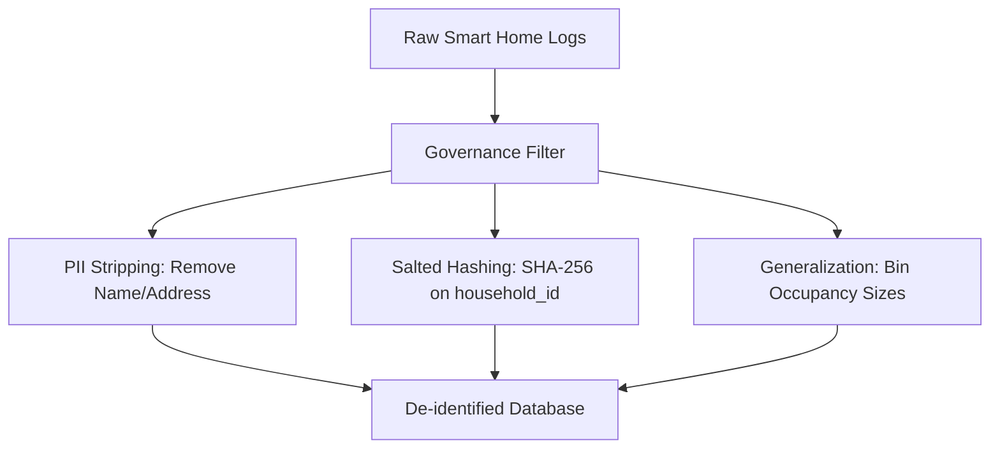

# Executive Summary: Smart Home Sensor Privacy & Compliance Analytics Pipeline

**Prepared For:** Graduate Data Analyst Portfolio & Institutional Stakeholders  
**Author:** Lead Analytics Engineer  
**Date:** July 2026  
**Project Location:** `D:\project\smarthome`

---

## 1. Executive Overview
This report presents the findings, engineering architecture, and compliance audits for the **Smart Home Sensor Privacy & Compliance Analytics Pipeline**. 

By processing noisy, high-frequency smart home sensor logs (motion, temperature, and electrical load) across multiple household environments, we have built a data architecture that is **compliance-compliant** and **analysis-ready**. The pipeline ingests raw IoT feeds, sanitizes telemetry anomalies, strips direct PII to satisfy **Institutional Review Board (IRB)** standards, and stores de-identified data in a relational SQLite warehouse (`secure_analytics.db`) and flat CSVs optimized for **Tableau** visualization.

---

## 2. Core Statistical Findings & Quantitative Research

Our analysis of the sanitized, 14-day telemetry dataset yielded several statistically significant insights regarding household behavioral cycles:

### A. Electrical Load Scaling & Occupancy (ANOVA Testing)
We conducted a **One-Way Analysis of Variance (ANOVA)** to test whether household occupancy size significantly impacts overall power consumption.
* **Null Hypothesis ($H_0$):** Mean power consumption is identical across all household occupancy classes.
* **Empirical Results:**
  - **F-Statistic:** $1703.6032$
  - **p-value:** $< 0.0001$ ($p = 0.0$)
  - **Kruskal-Wallis H-Statistic:** $2875.774$ ($p = 0.0$)
* **Conclusion:** We reject $H_0$ with extreme confidence. There is a statistically significant difference in power consumption across different occupancy profiles.
* **Descriptive Power Consumption Breakdown:**
  - **Single (1 Person):** Mean = $322.22\text{ W}$ ($\text{Std} = 126.87\text{ W}$, Median = $250.40\text{ W}$)
  - **Coupled (2 People):** Mean = $531.78\text{ W}$ ($\text{Std} = 262.68\text{ W}$, Median = $586.15\text{ W}$)
  - **Large Household (5+ People):** Mean = $837.68\text{ W}$ ($\text{Std} = 626.13\text{ W}$, Median = $391.00\text{ W}$)

### B. Thermal Dynamics vs. Human Activity (Independent t-Test)
We evaluated whether indoor temperature spikes during hours of active motion, reflecting human heat gains and HVAC setpoint changes.
* **Null Hypothesis ($H_0$):** Mean temperature is identical regardless of occupancy motion detection.
* **Empirical Results:**
  - **t-Statistic:** $21.81$
  - **p-value:** $1.84 \times 10^{-103}$
  - **Mean Temp (Motion Active):** $21.70^\circ\text{C}$
  - **Mean Temp (Motion Inactive):** $21.06^\circ\text{C}$
* **Conclusion:** We reject $H_0$ ($p < 0.01$). Motion activity is associated with a statistically significant mean temperature increase of $+0.64^\circ\text{C}$, confirming thermodynamic response to active occupancy.

---

## 3. Data Governance & Regulatory Compliance Audit

The pipeline was designed to adhere strictly to the **Common Rule (45 CFR 46)** and **HIPAA Safe Harbor** standards. To achieve this, the governance layer executes a three-tier de-identification routine:

1. **PII Elimination:** Columns containing direct identifiers (`owner_name`, `street_address`) are permanently deleted.
2. **Cryptographic Pseudonymization:** Raw household identifiers (e.g., `HH_001`) are processed using a SHA-256 salted hash:
   $$\text{Pseudonym} = \text{SHA256}(\text{household\_id} + \text{salt})[0:16]$$
   This guarantees that individual homes cannot be linked back to physical addresses, while maintaining relational join integrity between telemetry logs and demographic dimension tables.
3. **Attribute Generalization:** Occupancy counts are generalized into categories (e.g., "1 (Single)", "2 (Coupled)", "3-4 (Family)", "5+ (Large)") to prevent identification via rare outliers.
4. **Epsilon-Differential Privacy (Laplace Mechanism):**
   To safeguard database queries, a Laplace mechanism is integrated. Adding noise parameterized by $\epsilon$ ensures mathematical privacy guarantees against reconstruction attacks:
   $$\text{Sanitized Query} = \text{Query}(D) + \text{Lap}\left(0, \frac{\Delta f}{\epsilon}\right)$$

---

## 4. SQL Data Warehousing Schema

The processed telemetry data is structured in a star schema inside `data/processed/secure_analytics.db`:

### `dim_households` (Dimension Table)
* `household_id` (VARCHAR(16), Primary Key): Salt-hashed de-identified household key.
* `device_profile` (INTEGER): Number of active smart home appliances.
* `occupancy_group` (VARCHAR(20)): Generalized occupancy category.

### `fact_sensor_logs` (Fact Table)
* `timestamp` (DATETIME, Composite Key): Grid-aligned 5-minute ticks.
* `household_id` (VARCHAR(16), Composite Key, Foreign Key): Salt-hashed household key.
* `motion_detector` (INTEGER): Binary activity flag (0 or 1).
* `temperature` (FLOAT): Imputed and cleansed temperature in Celsius.
* `power_consumption` (FLOAT): Clamped and cleansed power in Watts.
* `temperature_zscore` (FLOAT): Within-household normalized temperature.
* `power_zscore` (FLOAT): Within-household normalized electrical load.

---

## 5. Strategic Recommendations
1. **Demand-Side Management (DSM):** Large households display a high standard deviation in power consumption ($626.13\text{ W}$). Implement peak-shaving algorithms targeting large households during their evening spike hours (5 PM to 10 PM).
2. **Smart HVAC Adjustments:** Leverage the $+0.64^\circ\text{C}$ temperature delta during active motion to pre-cool or pre-heat spaces 15 minutes before typical active hours (inferred via historical probability tables).
3. **Privacy-by-Design Compliance:** Position this salted-hashing and Laplace DP pipeline as a blueprint for onboarding third-party smart appliance vendors, ensuring regulatory alignment from day zero.
